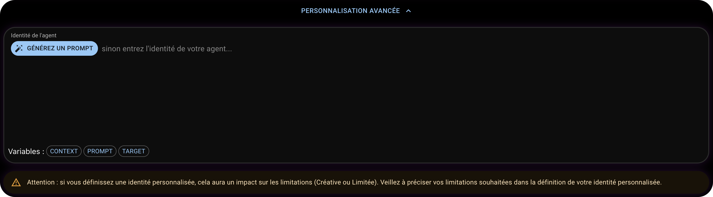

# 📦 Mise à jour 0.2.123

## 🎉 Nouveautés

### Affichage des favoris sur la page d'accueil

Il est désormais possible de voir les agents favoris directement sur la page d'accueil.

---

### Nouvelle interface de personnalisation d'identité

Nous avons complètement revu l'interface de personnalisation de l'identité des Agents. Vous pouvez désormais choisir parmis  deux modes : Limité ou Libre. Une description de chaque mode est disponible directement dans l'interface.

Nous avons également ajouté un bouton "Personnalisation avancée" qui vous permet de personnaliser l'identité avec des options avancées.

---

