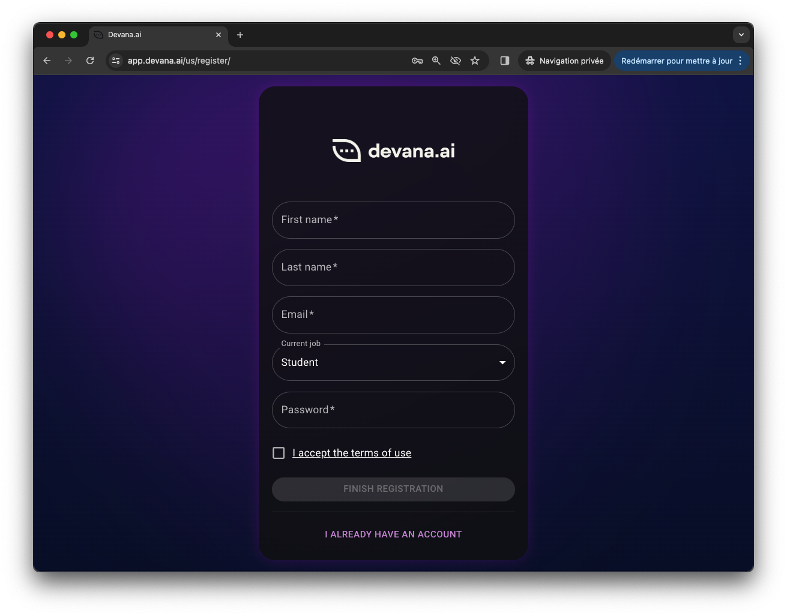
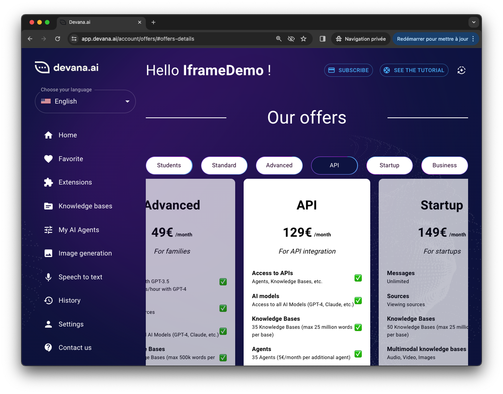
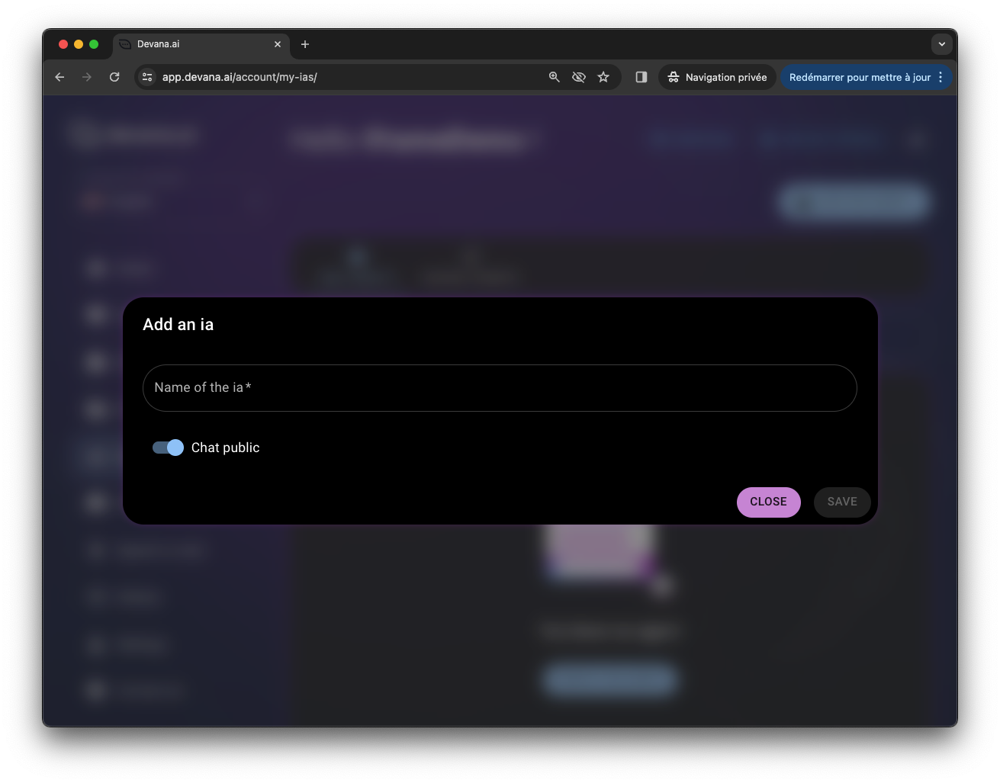
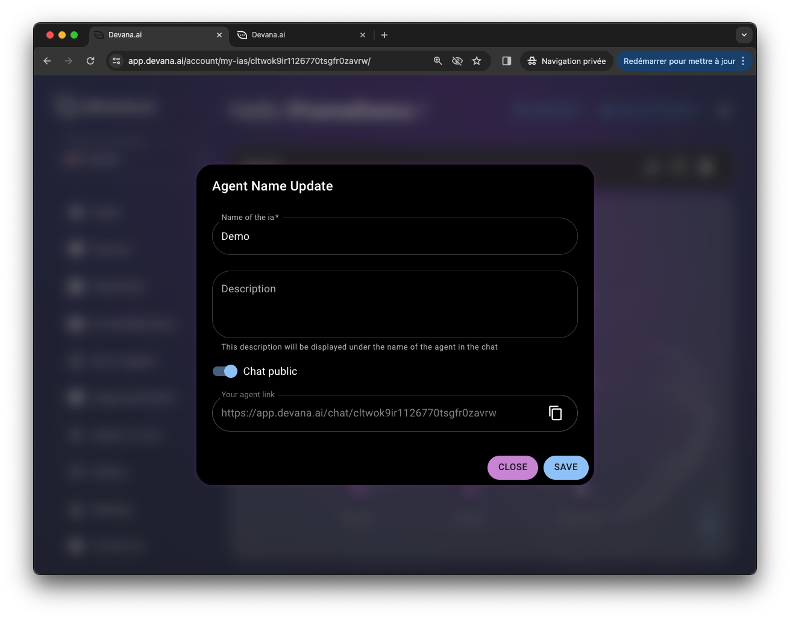

# Devana IFrame Documentation

Welcome to the Devana IFrame documentation. This guide will help you integrate Devana's AI capabilities into your web application using an IFrame. Before starting, ensure that you have an account on [Devana](https://app.devana.ai) and an API account. Follow the step-by-step instructions below:

## Step 1: Set Up Your Devana Account
To use Devana's services, you first need to have an active account. If you don't have one, visit [Devana](https://app.devana.ai) to create an account. 



## Step 2: Obtain an API Account
Having an API account is vital as it enables you to access and interact with the various Devana APIs. If you do not have an API account, navigate to the API account section on the Devana website to create one.



## Step 3: Create a Public Agent
Next, you must create an agent and make it public using the Devana interface. This public agent will be the primary actor for your IFrame.



## Step 4: Retrieve Agent Link
Once your public agent is set up, retrieve the agent's link. You will use this link to connect the agent to your website.



## Step 5: Embed the Agent Link in an IFrame
Finally, add the agent's link to an IFrame on your website. The format of the URL should be: `https://app.devana.ai/chat/{ID}/`, where `{ID}` is replaced by your agent's unique ID.


Here is a sample code for embedding the IFrame:

```html
<iframe src="https://app.devana.ai/chat/{ID}/" width="500" height="600"></iframe>
```

Remember to replace `{ID}` with your agent's unique ID.

And that's it! You have successfully integrated a Devana agent into your web application using an IFrame. If you encounter any issues, please refer back to this documentation or contact our support team.

# Devana IFrame as a Chatbot Integration Guide

This guide provides an example of how to integrate Devana's IFrame as a chatbot that opens in the corner of your application upon clicking a button. This feature enriches user experience by providing immediate access to an AI assistant. The example uses a combination of HTML, CSS, and JavaScript.

## Step 1: HTML Structure

The first step involves creating an HTML structure for the chatbot button and the IFrame. Add the following HTML code to your application:

```HTML
<button id="open-chatbot">Open Chatbot</button>

<div id="chatbot-container" style="display: none;">
    <div id="chatbot-header">
        <h4>Devana Chatbot</h4>
        <button id="close-chatbot">X</button>
    </div>
    <iframe src="https://app.devana.ai/chat/{ID}/" width="100%" height="100%" id="devana-chatbot"></iframe>
</div>
```

Replace `{ID}` in the iframe URL with your unique agent's ID.

## Step 2: CSS Styling

Add the following CSS to your application to position the chatbot and button correctly:

```CSS
#chatbot-container {
    position: fixed;
    bottom: 0;
    right: 0;
    width: 300px;
    height: 500px;
    border: 1px solid black;
    background-color: white;
    z-index: 1000;
}

#chatbot-header {
    display: flex;
    justify-content: space-between;
    padding: 10px;
    background-color: #f1f1f1;
    border-bottom: 1px solid #ddd;
}

#open-chatbot {
    position: fixed;
    bottom: 20px;
    right: 20px;
}
```

## Step 3: JavaScript Event Handlers

To make the chatbot open and close upon clicking the appropriate button, you need to add JavaScript event handlers. Add the following JavaScript code to your application:

```JavaScript
document.getElementById('open-chatbot').addEventListener('click', function() {
    document.getElementById('chatbot-container').style.display = 'block';
});

document.getElementById('close-chatbot').addEventListener('click', function() {
    document.getElementById('chatbot-container').style.display = 'none';
});
```
This code will create a button on your application that, when clicked, opens an IFrame at the bottom right of your application. You can close the chatbot by clicking the "X" button.

And that's it! You have successfully integrated a Devana agent in the form of a chatbot into your web application. If you encounter any issues, please refer back to this documentation or contact our support team.