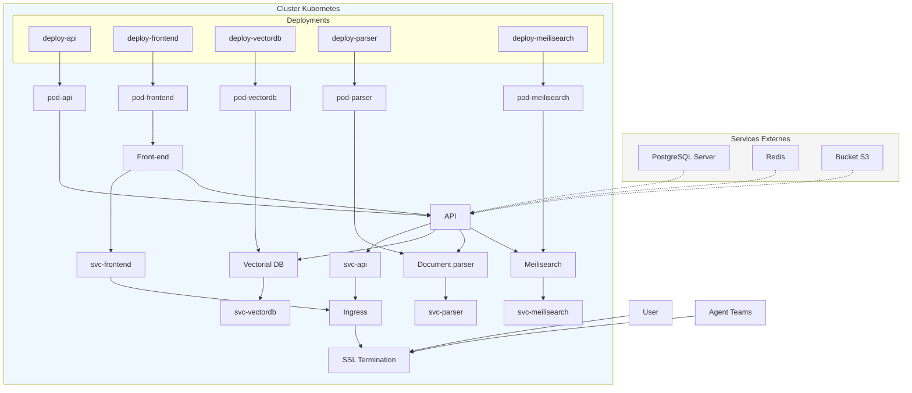
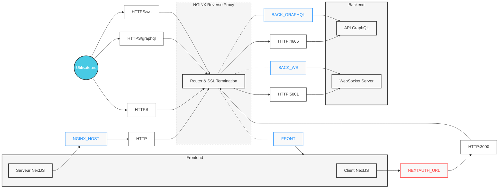

# Devana On-Premise

Bienvenue dans la documentation expliquant le fonctionnement du on-premise de Devana. Cette documentation est divisée en plusieurs parties, que vous pouvez retrouver ci-dessous.

> **Attention**: Cette documentation est en cours de rédaction et peut contenir des erreurs. N'hésitez pas à nous contacter si vous avez des questions via l'adresse support-it@devana.ai. 
>
> **Confidentialité**: Cette documentation contient des informations sensibles. Merci de ne pas la partager en dehors de l'entreprise.

## Infrastructure

**L'infrastructure Devana est composée de plusieurs éléments clés :**
* Un cluster Kubernetes pour orchestrer les différents services et assurer la scalabilité et la haute disponibilité
* Une base de données PostgreSQL pour stocker les données structurées de l'application
* Un serveur de fichiers S3 (comme Amazon S3 ou MinIO) pour stocker les fichiers et les données non structurées
* Un serveur Redis pour la mise en cache et la gestion des sessions

Voici un diagramme expliquant l'architecture de l'infrastructure Devana pour le on-premise :



Le cluster Kubernetes est au cœur de l'infrastructure et gère les différents services de l'application Devana. Il communique avec la base de données PostgreSQL pour la persistance des données, avec le serveur de fichiers S3 pour le stockage des fichiers, et avec le serveur Redis pour la mise en cache et la gestion des sessions. Concernant Redis, vous pouvez également utiliser un cluster Redis si vous souhaitez l'heberger directement dans kubernetes.

## Réseau



## Compatibilité

Le on-premise de Devana est compatible avec les principales plateformes de cloud computing :
- **Microsoft Azure**: Devana peut être déployé sur Azure Kubernetes Service (AKS) et utiliser Azure Database pour PostgreSQL, Azure Blob Storage et Azure Cache pour Redis.
- **Amazon Web Services (AWS)**: Devana est compatible avec Amazon Elastic Kubernetes Service (EKS), Amazon RDS pour PostgreSQL, Amazon S3 et Amazon ElastiCache pour Redis.
- **Google Cloud Platform (GCP)**: Devana peut être installé sur Google Kubernetes Engine (GKE), avec Cloud SQL pour PostgreSQL, Google Cloud Storage et Memorystore pour Redis.

Pour chaque plateforme, il est nécessaire de respecter les prérequis suivants :
- Un cluster Kubernetes (version 1.19 ou supérieure) avec au moins 3 nœuds
- Une base de données PostgreSQL (version 12 ou supérieure)
- Un serveur de fichiers S3 compatible
- Un serveur Redis (version 6 ou supérieure)

Avant de procéder à l'installation de Devana, assurez-vous que votre infrastructure remplit ces conditions et que vous disposez des accès et autorisations nécessaires pour créer et gérer les ressources sur votre plateforme de cloud.

## Recommandations de performance par pod

Pour garantir des performances optimales de l'application Devana, il est important de dimensionner correctement les ressources allouées à chaque pod. Voici quelques recommandations pour les principaux composants :

### Document parser

- CPU : **4 vCPU** (selon la quantité de documents à traiter)
- RAM : **4 Go**
- Disque : **20 Go**

> Nous recommandons d'utiliser un réplica set de minimum 4 pods pour garantir la haute disponibilité du service en cas de dépôt de plusieurs documents en simultanés.
>
> Lors d'un premier run, nous vous recommandons de lancer un ensemble de X pods afin d'absorber les premiers documents de l'entreprise. Vous pouvez par la suite réduire le nombre de prods à 4 pods minimum. 

### API

- CPU : **4 vCPU**
- RAM : **4 Go**
- Disque : **10 Go**

> Nous recommandons d'utiliser un réplica set de minimum 2 pods pour garantir la haute disponibilité.

### Frontend

- CPU : 1 vCPU
- RAM : 1 Go
- Disque : 5 Go

> Nous recommandons d'utiliser un réplica set de minimum 2 pods pour garantir la haute disponibilité.

### Vectorial DB

- CPU : 4 vCPU (selon la taille de votre base de données)
- RAM : 8 Go
- Disque : 100 Go (selon la taille de votre base de données)

> Vous devez lancer un seul pod pour le service de Vectorial DB.

### Redis*

- CPU : 1 vCPU
- RAM : 2 Go
- Disque : 10 Go

> Vous devez lancer un seul pod pour le service de Redis.

*Si vous utilisez un cluster Redis géré par votre fournisseur de cloud, référez-vous à leurs recommandations spécifiques.*

Ces recommandations sont données à titre indicatif et peuvent varier en fonction de votre charge de travail et du nombre d'utilisateurs. Il est conseillé de surveiller régulièrement les performances de votre application et d'ajuster les ressources en conséquence.

## Test de performance
Nous avons utilisé un script Python avec Selenium et du multithreading pour réaliser un test de charge basé sur un navigateur web. Ce script nous fournit le taux de réussite, le temps moyen de connexion ainsi que le temps moyen pour recevoir une réponse. Ce test a été effectué sur une base de connaissances comprenant des informations sur Devana de manière générale, avec un agent connecté à cette base et à GPT4O-Mini. Le parcours utilisateur simulé consistait à accéder à Devana, se connecter, sélectionner un agent, puis envoyer et recevoir une question/réponse.

- Taux de réussite : le pourcentage de threads ayant réussi à accomplir les tâches imposées, à savoir :
  - 10 secondes d'attente maximum après avoir cliqué sur le bouton de connexion.
  - 5 secondes d'attente maximum entre chaque page.
  - 30 secondes d'attente maximum pour que l'agent retourne une réponse après une question.
- Temps moyen pour se connecter : la moyenne du temps nécessaire pour que les threads passent de l'initialisation à l'état connecté.
- Temps moyen pour recevoir une réponse : la moyenne du temps pris par les threads pour compléter le parcours utilisateur, c'est-à-dire recevoir une réponse de l'agent.

Pour obtenir un taux de réussite de 100%, avec un décalage de 1s entre le début de chaque thread, le nombre maximum de threads est de 25, soit 25 utilisateurs simultanés. Pour augmenter ce nombre, il suffit de multiplier les conteneurs.

```
--- Résumé des métriques ---
Temps moyen pour le login : 12.06 secondes
Temps moyen pour recevoir une réponse : 36.20 secondes
Pourcentage de succès : 100.00%
```

## Détails des Données Collectées pour la Vérification de Licence et la Maintenance

Dans le cadre de l'utilisation de Devana on-prem, notre serveur de licence collecte automatiquement certaines métriques de votre système toutes les 5 minutes. Ces données sont essentielles pour assurer la conformité avec le contrat de licence et faciliter la maintenance proactive. Les métriques recueillies incluent :

- **Utilisation du CPU** : Nous surveillons l'utilisation du processeur, en calculant les pourcentages d'utilisation pour les différents états (utilisateur, système, idle, irq) afin d'évaluer les performances du système.
- **Utilisation de la Mémoire** : Nous collectons des informations sur la mémoire totale, la mémoire libre et la mémoire utilisée de la machine pour surveiller les ressources disponibles.
- **Statistiques Utilisateurs et Messages** : Nous comptons le nombre total d'utilisateurs, le nombre de messages envoyés, et le nombre de tokens utilisés, afin de comprendre l'usage de la plateforme.
- **Nombre d'Agents et de Bases de Connaissances** : Nous suivons le nombre d'agents et de bases de connaissances actifs pour optimiser l'efficacité de la solution.
- **Informations Réseau** : Nous enregistrons les détails des interfaces réseau (nom, adresse IP, adresse MAC) pour diagnostiquer et résoudre d'éventuels problèmes de connectivité.
- **Informations sur le Processus** : Nous collectons l'identifiant du processus courant pour le suivi des performances et le dépannage.

Ces données sont transmises de manière sécurisée à notre serveur de métriques pour garantir que votre utilisation de Devana reste conforme aux termes de la licence et pour nous aider à fournir un support technique efficace en cas de besoin. La collecte régulière de ces informations permet également de prévenir et de résoudre plus rapidement les éventuels problèmes techniques.

# Installation

Pour effectuer l'installation de Devana, vous devez suivre les étapes décrites dans le document suivant : 
- [Installation Kubernetes](./doc/kube/README.md).
- [Tutoriels Azure (WIP)](./doc/azure/README.md)

# Déploiement de la base de données

Pour déployer la base de données PostgreSQL de Devana, vous pouvez suivre les instructions présentes dans le document suivant :
- [Déploiement de la base de données](./doc/db/postgresql.md).

# Ajout d'un model

Pour ajouter un modèle personnalisé à Devana, vous pouvez l'ajouter via l'interface d'administration de Devana ou en utilisant l'accès base de données, vous pouvez suivre les instructions présentes dans le document suivant :
- [Ajout d'un model](./doc/ai/custom-model.md).

